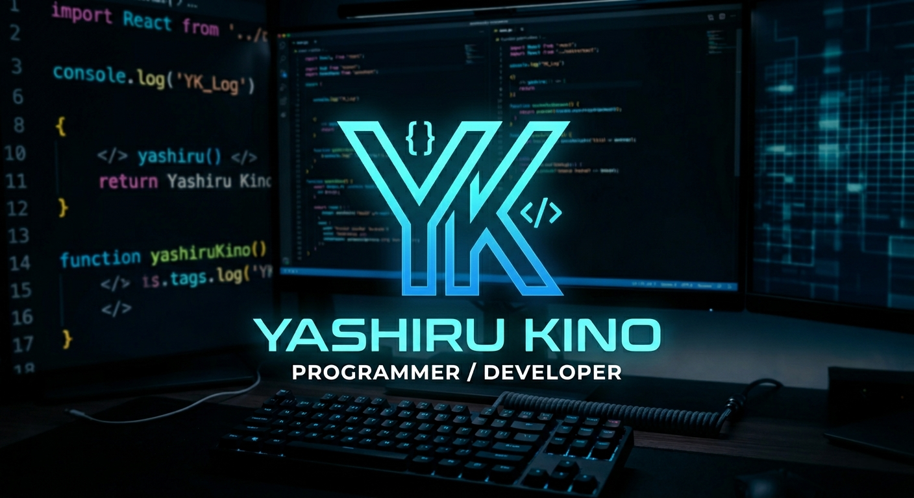

<h1 align="center">Hi 👋, I'm Ilyas Hidayat Rusdy</h1>
<h3 align="center">A Programmer from Indonesia</h3>

- 🔭 I’m currently working on [Web Animal Save](https://github.com/IlyasHidayatR/WebAnimalSave)

- 🌱 I’m currently learning **Laravel, React JS, and Python**

- 📫 How to reach me **saylihidayatrusdy@gmail.com**

<h3 align="left">Connect with me:</h3>

  &nbsp;
  &nbsp;
  &nbsp;
  

<h3 align="left">Languages and Tools:</h3>

  &nbsp;
  &nbsp;
  &nbsp;
  &nbsp;
  &nbsp;
  &nbsp;
  &nbsp;
  &nbsp;
  &nbsp;
  &nbsp;
  &nbsp;
  &nbsp;
  &nbsp;
  &nbsp;
  &nbsp;
  &nbsp;
  &nbsp;
  &nbsp;
  &nbsp;
  &nbsp;
  &nbsp;
  &nbsp;
  

